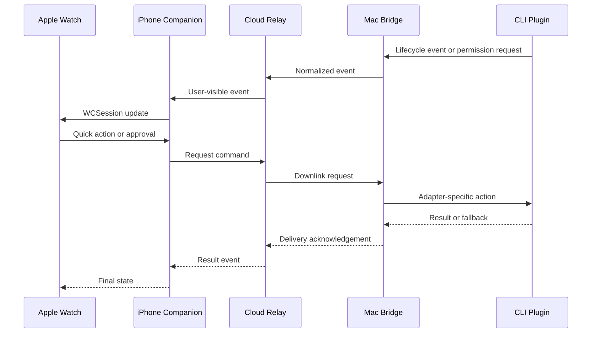

# ADR 0001: Watch, iPhone, Cloud Relay, and Mac Topology

## Status

Accepted

## Context

Kiri Friends turns Claude Code, OpenCode, and Codex CLI sessions into a wrist companion experience. The Apple Watch should show glanceable status, surface action-required moments, and allow a small set of quick responses without requiring the user to open a terminal or pull out a phone.

The supported CLI tools run on the user's Mac. The watchOS app cannot reliably connect directly to local Mac processes, cannot host long-running networking work, and must preserve battery and privacy. The iPhone companion is the correct local counterpart for watchOS, but it may not always be on the same network as the Mac. Users also expect remote notification and request delivery when they leave the desk.

## Decision

Kiri Friends uses a four-part topology:

```text
Apple Watch
  <-> iPhone Companion
  <-> Cloud Relay Server
  <-> Mac Bridge
  <-> CLI plugins and hooks
```

The Apple Watch never talks directly to the Mac CLI or Cloud Relay. The iPhone companion owns WatchConnectivity and the user-facing mobile account/session. The Cloud Relay server owns cross-network routing, device presence, request queues, and delivery acknowledgement. The Mac bridge owns local CLI integration, plugin/hook ingestion, session normalization, and command execution handoff.

## Responsibilities

### Apple Watch

- Display active CLI status and high-priority alerts.
- Offer quick actions that can complete in a few seconds.
- Render complications and Smart Stack widgets from last-known state.
- Send watch actions to the iPhone companion through WatchConnectivity.
- Redact sensitive details in complications and Always On contexts.

### iPhone Companion

- Pair the user's Apple Watch with the user's Kiri account and Mac devices.
- Cache the latest normalized state for offline watch display.
- Relay watch-originated commands to the Cloud Relay.
- Convert Cloud Relay events into local state, notifications, and WatchConnectivity updates.
- Own notification permission prompts and user notification settings.

### Cloud Relay Server

- Authenticate devices and bind them to a user account.
- Maintain device and session presence for iPhone companions and Mac bridges.
- Route watch-originated requests to the selected Mac bridge.
- Queue downlink messages while a Mac bridge or iPhone is temporarily unavailable.
- Receive CLI events from Mac bridges and fan them out to the user's active companion devices.
- Record delivery acknowledgement, retry state, and expiration.
- Enforce rate limits, payload size limits, and data retention policy.

### Mac Bridge

- Run as a local user process on the Mac.
- Accept events from Claude Code hooks, Codex hooks, and OpenCode plugins.
- Normalize tool-specific events into Kiri Friends domain events.
- Connect outbound to the Cloud Relay; the relay does not require inbound access to the user's Mac.
- Dispatch requests from the relay to the active CLI adapter when supported.
- Degrade gracefully when the relay or watch path is unavailable.

### CLI Plugins and Hooks

- Stay small and tool-specific.
- Read hook payloads from stdin when required by the host CLI.
- Write only host-CLI-approved response JSON to stdout when a decision is required.
- Send diagnostics to stderr or local logs.
- Use strict timeouts so the CLI can fall back to native behavior.
- Never talk directly to the Apple Watch or iPhone companion.

## Primary Data Flow



## Consequences

### Positive

- The watchOS app remains battery-friendly and native.
- Remote delivery works when the Mac and iPhone are not on the same local network.
- The Mac bridge can use outbound-only connectivity, avoiding router or firewall setup.
- CLI-specific behavior stays isolated in plugins and adapters.
- The Cloud Relay can provide reliable routing, retries, and device presence.

### Negative

- A Cloud Relay introduces account, authentication, privacy, and operational responsibilities.
- End-to-end latency is higher than a purely local bridge.
- Server outages can affect remote request delivery.
- Sensitive CLI context must be carefully minimized, redacted, or encrypted.

## Alternatives Considered

### Watch Directly to Mac

Rejected. It is brittle across networks, does not fit watchOS background limits, and creates unnecessary battery and security issues.

### iPhone Directly to Mac Only

Rejected as the primary topology. It works for local development and can remain a fallback path, but it does not support remote request delivery when devices are on different networks.

### Cloud Relay Without Mac Bridge

Rejected. CLI hooks and plugins need a local process that understands user configuration, active sessions, local sockets, and CLI-specific fallback behavior.

## Implementation Guidance

- Prefer outbound connections from Mac bridge to Cloud Relay.
- Treat the Cloud Relay as a routing and delivery layer, not as a long-term transcript store.
- Keep watch payloads small and pre-redacted.
- Define every request with an idempotency key and an expiration time.
- Require acknowledgements for downlink requests that can affect CLI behavior.
- Preserve local fallback behavior for CLI permission prompts when the watch path is unavailable.

## Follow-up Documents

- `docs/server/relay-server.md`
- `docs/server/api.md`
- `docs/core/cli-bridge.md`
- `docs/core/cli-plugins.md`
- `docs/core/security-and-privacy.md`
- `docs/interfaces/watch-connectivity.md`
