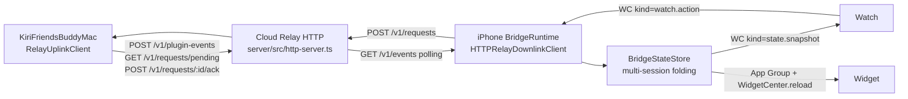

# Mac Buddy Interface

Kiri Buddy for macOS is a SwiftUI desktop pet that doubles as the Mac
side of the Kiri Friends CLI host bridge. It is a SwiftUI port of the
upstream [Clawd-on-Desk](https://github.com/rullerzhou-afk/clawd-on-desk)
project. The buddy receives plugin events over HTTP, drives an animated
overlay window, surfaces permission bubbles for blocking approvals, and
relays normalised events to the Cloud Relay so the iPhone and Watch can
follow along.

## Target Layout

| Target | Type | Sources | License |
| --- | --- | --- | --- |
| `KiriFriendsMacBuddyKit` | SwiftPM library | `apps/apple/Sources/KiriFriendsMacBuddyKit/` | AGPL-3.0 |
| `KiriFriendsBuddyMac` | SwiftPM executable + XcodeGen macOS app | `apps/apple/Sources/KiriFriendsBuddyMac/` | AGPL-3.0 |
| `KiriFriendsMacBuddyKitTests` | SwiftPM test target | `apps/apple/Tests/KiriFriendsMacBuddyKitTests/` | AGPL-3.0 |

Both targets depend on `KiriFriendsCore` for cross-device domain types.
Nothing else in the workspace depends on `KiriFriendsMacBuddyKit`. See
`docs/operations/license-boundaries.md` for the full license rationale.

## Configuration

| File | Purpose |
| --- | --- |
| `apps/apple/Configuration/KiriFriendsBuddyMac-Info.plist` | Bundle metadata, `LSUIElement` (no Dock icon), usage descriptions for Apple Events and Accessibility. |
| `apps/apple/Configuration/KiriFriendsBuddyMac.entitlements` | App Sandbox disabled, network client + server, automation Apple Events, user-selected file read/write. |

## Build and Run

```bash
make build-mac    # SwiftPM build of the library + executable
make test-mac     # Run KiriFriendsMacBuddyKitTests
make dev-mac      # XcodeGen → xcodebuild → open Kiri Buddy.app
```

## Runtime Architecture

```mermaid
flowchart LR
  subgraph cli [CLI Hosts]
    Claude[Claude Code]
    Codex[Codex CLI]
    Copilot[Copilot CLI]
    Gemini[Gemini CLI]
    Cursor[Cursor Agent]
    CodeBuddy[CodeBuddy]
    Kiro[Kiro CLI]
    Kimi[Kimi CLI]
    Opencode[OpenCode]
    Pi[Pi]
    OpenClaw[OpenClaw]
    Hermes[Hermes Agent]
  end
  cli -->|stdin/stdout JSON| Hooks[plugins TS / Python hooks]
  Hooks -->|HTTP 127.0.0.1| BuddyMac[KiriFriendsBuddyMac]
  BuddyMac -->|outbound HTTPS| Relay[Cloud Relay]
  Relay --> Phone[iPhone companion]
  Phone --> Watch[watchOS app]
  BuddyMac -.->|Buddy window<br/>Permission bubble<br/>Session HUD<br/>Status bar| User[(User)]
```



`KiriFriendsBuddyMac` is the single Mac-side process. The legacy
`KiriFriendsCLI` executable is now only a small diagnostics helper; bridge
runtime ownership lives in Mac Buddy.

## Module Map

### KiriFriendsMacBuddyKit (library)

| Module | Responsibility |
| --- | --- |
| `MacBuddyKit.swift` | Shared constants (bridge port, support directory). |
| `MacBuddyState.swift` | Animation state vocabulary (10 base + 4 sleep frames). |
| `AgentIdentifier.swift` | Stable identifier set for all 12 agents. |
| `Agents/AgentDescriptor.swift` | Per-agent configuration record. |
| `Agents/AgentRegistry.swift` | Static registry of all 12 agent descriptors. |
| `State/MacBuddyStateStore.swift` | Actor state machine; priority resolution, auto-return, sleep, permission lock. |
| `State/BuddySession.swift` | Per-session record. |
| `State/MacBuddyStateEvent.swift` | Plugin event input + display snapshot output. |
| `State/BuddyWindowStateStore.swift` | Position persistence at `~/.kirifriends/buddy-window.json`. |
| `State/BuddyClickReactionTracker.swift` | Double / quadruple-click streak tracking. |
| `State/BuddyWorkAreaResolver.swift` | Multi-display work-area clamp. |
| `HTTP/HTTPServer.swift` | NWListener-based loopback HTTP server. |
| `HTTP/HTTPParser.swift` | Minimal HTTP/1.1 parser. |
| `HTTP/HTTPRouter.swift` | (method, path) → handler dispatch. |
| `HTTP/HTTPMessage.swift` | Request and response value types. |
| `Bridge/BridgeService.swift` | Top-level facade wiring HTTP, store, relay, permissions, DND. |
| `Bridge/PluginEvent.swift` | Wire shape for `POST /v1/plugin-events`. |
| `Bridge/LegacyStateRequest.swift` | Compatibility shape for `POST /state`. |
| `Bridge/PermissionRequest.swift` | Wire shape for `POST /permission`. |
| `Relay/RelayUplinkClient.swift` | Outbound Cloud Relay client: plugin event uplink, pending request polling, and request acknowledgement. |
| `Permission/PermissionBubbleService.swift` | Async-await bridge between the HTTP route and the bubble UI. |
| `Permission/DoNotDisturbState.swift` | Centralised DND flag. |
| `Theme/ThemeDescriptor.swift` | Schema for `theme.json` (mirror of upstream Clawd format). |
| `Theme/ThemeLoader.swift` | Discovers and loads themes from bundle / user directories. |
| `Theme/CodexPetImporter.swift` | Extracts Codex Pet zips ready for theme conversion. |
| `Doctor/DoctorReport.swift` | Bridge health snapshot. |

### KiriFriendsBuddyMac (executable)

| Module | Responsibility |
| --- | --- |
| `KiriFriendsBuddyMacApp.swift` | SwiftUI App entry, Settings scene, Sessions Dashboard scene. |
| `AppKit/BuddyAppDelegate.swift` | NSApplicationDelegate; lifecycle for the buddy window, permission manager, HUD, status bar. |
| `AppKit/BuddyWindowController.swift` | Transparent floating buddy NSWindow with drag, click reactions, eye tracking, position memory. |
| `AppKit/BuddyAnimationView.swift` | WKWebView wrapper that renders the active theme's SVG and forwards eye-tracking offsets. |
| `AppKit/Permission/PermissionBubbleManager.swift` | Subscribes to the bubble service and manages stacked bubble windows. |
| `AppKit/Permission/PermissionBubbleWindowController.swift` | Floating window for one pending request. |
| `AppKit/Permission/PermissionBubbleView.swift` | SwiftUI card with Allow / Deny / Always controls. |
| `AppKit/Sessions/SessionHUDController.swift` | Compact floating panel showing live sessions. |
| `AppKit/Sessions/SessionHUDView.swift` | SwiftUI HUD content. |
| `AppKit/Sessions/SessionsDashboardView.swift` | SwiftUI dashboard scene (read-only table). |
| `AppKit/System/StatusBarController.swift` | NSStatusItem with DND toggle, dashboard shortcut, Quit. |
| `Theme/BuddyThemeAssets.swift` | Bundles the three bundled themes via `Bundle.module`. |
| `BridgeAppModel.swift` | `@Observable` model exposing bridge status + display snapshot to SwiftUI. |
| `Views/BuddyRootView.swift` | Settings status scene showing bridge health and current display state. |

## Phase Status

| Phase | Scope | Status |
| --- | --- | --- |
| 0 | Scaffolding, license split, dev tooling | Shipped |
| 1 | Mac bridge core (HTTP server, state store, agent registry, relay client) | Shipped |
| 2 | Buddy window + WKWebView animation, 5 core states | Shipped |
| 3 | Drag, click reactions, multi-display, position memory | Shipped |
| 4 | Theme system (Clawd / Calico / Cloudling, Codex Pet importer) | Shipped |
| 5 | Permission bubble | Shipped |
| 6 | Plugin breadth (9 additional CLI integrations) | Shipped (TS lifecycle mappers) |
| 7 | Sessions HUD + dashboard | Shipped (HUD + read-only dashboard) |
| 8 | NSStatusItem tray, DND | Shipped (autostart, sound, i18n, Sparkle deferred) |
| 9 | Doctor report | Shipped (Remote SSH deferred) |
| 10 | Documentation + test matrix | Shipped |

## Bundled Themes

The executable ships with three themes copied verbatim from upstream
under AGPL-3.0:

- `Resources/Themes/clawd/` — Clawd pixel crab (SVG variants).
- `Resources/Themes/calico/` — Three-colour cat (APNG sprites).
- `Resources/Themes/cloudling/` — Cloudling (SVG variants).

User-installed themes go under `~/.kirifriends/themes/<id>/`. The
`ThemeLoader` resolves themes in that order (bundled first, then user
overrides).

## HTTP Surface

| Route | Method | Purpose |
| --- | --- | --- |
| `/healthz` | GET | Liveness check; returns the current bridge port and display state. |
| `/v1/plugin-events` | POST | New plugin envelope path used by `plugins/src/`. |
| `/state` | POST | Legacy Clawd-on-Desk hook payload path. |
| `/permission` | POST | Blocking permission request, returns Allow/Deny/Decline. |

All routes are bound to `127.0.0.1` with `acceptLocalOnly = true`. The
preferred port is `7474`; fallbacks step through `7475…7478`.

## Watch / iPhone / Widget Sync

The Mac Buddy is the producer; the rest of the workspace consumes the
relay events it uplinks. The full data path is:



- Multi-session folding happens in
  `apps/apple/Sources/KiriFriendsBridge/BridgeStateStore.swift`; see
  `docs/interfaces/watch-connectivity.md` for the resulting payload
  shape.
- Watch UX uses a hybrid layout: a glanceable Status tab plus a
  dedicated Sessions tab. The Commands tab acts on whichever session is
  selected in Sessions, falling back to the priority-resolved primary
  session.
- Watch-originated requests return through `/v1/requests/pending`; the
  Mac bridge marks them `accepted`, applies supported actions to the
  local state store, then sends `completed` or `failed`.
- Complication snapshots include a `+N` suffix when the buddy is
  tracking additional sessions beyond the primary one.
- The Watch renders the same theme art the Mac Buddy uses (Clawd /
  Calico / Cloudling). Resources ship inside
  `apps/apple/Sources/KiriFriendsWatchKit/Resources/Themes.xcassets/`
  and are pinned SHA-by-SHA against the Mac Buddy canonical copies via
  `make verify-watch-assets`. Theme selection follows
  `BuddySettings.activeManifestId` (set via the iPhone Settings →
  Buddy → Theme picker, mirrored to the Watch over WatchConnectivity).

## Tests

Run from `apps/apple/`:

```bash
swift test
```

The Mac Buddy targets contribute 14 test suites covering the agent
registry, state store, HTTP parser, router, bridge end-to-end, plugin
event envelopes, click tracker, work-area resolver, window state
persistence, theme loader, permission service, DND, and doctor report.

## License

Mac Buddy code, themes, and bundled assets are AGPL-3.0. The rest of
Kiri Friends remains MIT. Full breakdown in
`docs/operations/license-boundaries.md`.
