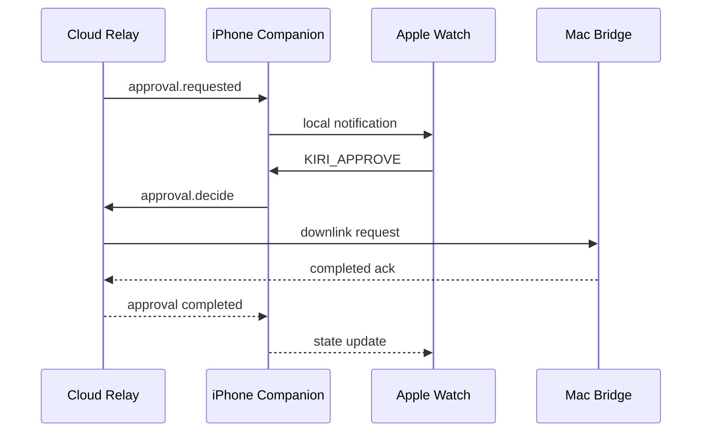

# Watch Notifications

Kiri Friends uses notifications for time-sensitive CLI moments. Notifications should be brief, actionable, and rare enough that users keep them enabled.

## Notification Principles

- Notify only when wrist attention is useful.
- Prefer actionable notifications over passive noise.
- Keep Short Look content generic and private by default.
- Use Long Look actions for approval, denial, stop, and open details.
- Batch or suppress low-priority output updates.

## Event Mapping

| CLI Event | Notification? | Reason |
| --- | --- | --- |
| `approval.requested` | Yes | User action may unblock the CLI. |
| `task.completed` | Optional | Useful for long-running tasks. |
| `session.failed` | Optional | Useful when intervention may be needed. |
| `connection.lost` | Optional | Useful when active work depends on bridge availability. |
| `output.preview` | No by default | Too noisy for watch notifications. |
| `tool.started` | No by default | Too frequent. |

## Categories

### `KIRI_APPROVAL_REQUIRED`

Purpose: ask the user to approve or deny a CLI action.

Actions:

- `KIRI_APPROVE`
- `KIRI_DENY`
- `KIRI_OPEN_DETAILS`

Default text:

- Title: `Approval required`
- Body: `A CLI action is waiting.`

Full command previews require explicit user opt-in.

### `KIRI_TASK_COMPLETED`

Purpose: tell the user a long-running task finished.

Actions:

- `KIRI_OPEN_DETAILS`
- `KIRI_DISMISS`

Default text:

- Title: `Task completed`
- Body: `Kiri has an update.`

### `KIRI_TASK_FAILED`

Purpose: tell the user a task failed.

Actions:

- `KIRI_OPEN_DETAILS`
- `KIRI_DISMISS`

Default text:

- Title: `Task failed`
- Body: `Open Kiri for details.`

### `KIRI_CONNECTION_CHANGED`

Purpose: tell the user the selected Mac bridge is unavailable during active work.

Actions:

- `KIRI_OPEN_CONNECTIONS`
- `KIRI_DISMISS`

Default text:

- Title: `Mac disconnected`
- Body: `Remote actions are unavailable.`

## Haptics

| Event | Haptic |
| --- | --- |
| Approval required | Notification |
| Approval accepted | Success |
| Approval denied | Direction down |
| Task completed | Success |
| Task failed | Failure |
| Connection lost | Retry |

Haptics should match urgency. Do not use failure haptics for normal completion.

## Privacy

Short Look notifications should avoid sensitive content.

Allowed by default:

- Generic title.
- Tool name when enabled.
- Generic state.

Not allowed by default:

- Full prompt.
- Full command.
- Output text.
- Project path.
- File names that may reveal private work.

Long Look notifications can include a sanitized summary when the user enables previews.

## Action Flow

## Throttling

Recommended suppression rules:

- Do not send repeated task update notifications for the same session.
- Coalesce multiple output previews into one task summary.
- Suppress completion notifications for tasks shorter than a user-configurable threshold.
- Avoid notifying on connection changes when no active session exists.

## Fallbacks

When notification permission is denied:

- App UI and complications still show action-required state.
- The iPhone companion should expose a settings prompt, not repeatedly nag.

When the watch is unavailable:

- iPhone notifications remain available.
- Relay request expiration still applies.

When the approval expires:

- Watch actions should be disabled or return an expired state.
- Codex-style hooks should fall back to the host CLI native approval flow.

## Testing Checklist

- [ ] Approval notification appears with approve and deny actions.
- [ ] Notification actions route through the relay and produce acknowledgements.
- [ ] Expired approval actions fail safely.
- [ ] Short Look text does not expose private content.
- [ ] Long Look respects preview settings.
- [ ] Haptics match event severity.
- [ ] Notification suppression prevents repeated low-value alerts.
